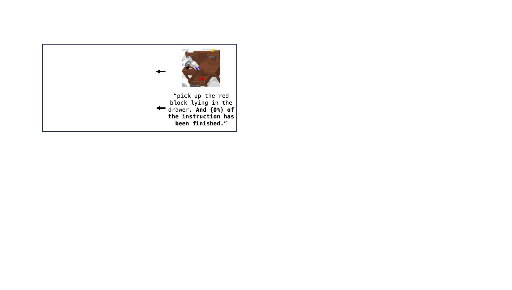

<h1>GR-MG</h1>

This repo contains code for the paper:
### Leveraging Partially Annotated Data via Multi-Modal Goal Conditioned Policy

[Peiyan Li](https://github.com/LPY1219), [Hongtao Wu<sup>\*‡</sup>](https://scholar.google.com/citations?hl=zh-CN&user=7u0TYgIAAAAJ&view_op=list_works&sortby=pubdate), [Yan Huang<sup>\*</sup>](https://yanrockhuang.github.io/), [Chilam Cheang](https://github.com/bytedance/GR-MG/tree/main), [Liang Wang](https://scholar.google.com/citations?hl=zh-CN&user=8kzzUboAAAAJ&view_op=list_works&sortby=pubdate), [Tao Kong](https://www.taokong.org/)

<sup>*</sup>Corresponding author   <sup>‡</sup> Project lead

### [🌐 Project Website](https://gr-mg.github.io/) | [📄 Paper](https://arxiv.org/abs/2408.14368)


<p align="center">
  
</p>


## News
- (🔥 New) **(2024.12.18)** Our paper was accepted by IEEE Robotics and Automation Letter (RA-L) !
- (🔥 New) **(2024.08.27)** We have released the code and checkpoints of GR-MG !
## Preparation
**Note:** We only test GR-MG with CUDA 12.1 and python 3.9

```bash
# clone this repository
git clone https://github.com/bytedance/GR-MG.git
cd GR_MG
# install dependencies for goal image generation model
bash ./goal_gen/install.sh
# install dependencies for multi-modal goal conditioned policy
bash ./policy/install.sh
```
Download the pretrained [InstructPix2Pix](https://huggingface.co/timbrooks/instruct-pix2pix) weights from Huggingface and save them in `resources/IP2P/`. 
Download the pretrained MAE encoder [mae_pretrain_vit_base.pth ](https://dl.fbaipublicfiles.com/mae/pretrain/mae_pretrain_vit_base.pth) and save it in `resources/MAE/`.
Download and unzip the [CALVIN](https://github.com/mees/calvin) dataset. 


## Checkpoints
- [Multi-modal Goal Conditioned Policy](https://lf-robot-opensource.bytetos.com/obj/lab-robot-public/gr_mg_release/epoch=47-step=83712.ckpt)
- [Goal Image Generation Model](https://lf-robot-opensource.bytetos.com/obj/lab-robot-public/gr_mg_release/goal_gen.ckpt)


## Training

### 1. Train Goal Image Generation Model
```bash
# modify the variables in the script before you execute the following instruction
bash ./goal_gen/train_ip2p.sh  ./goal_gen/config/train.json
```
### 2. Pretrain Multi-modal Goal Conditioned Policy
We use the method described in [GR-1](https://arxiv.org/abs/2312.13139) and pretrain our policy with Ego4D videos. You can download the pretrained model checkpoint [here](https://lf-robot-opensource.bytetos.com/obj/lab-robot-public/gr_mg_release/pretrained.pt). You can also pretrain the policy yourself using the scripts we provide. Before doing this, you'll need to download the [Ego4D](https://ego4d-data.org/) dataset.

```bash
# pretrain multi-modal goal conditioned policy
bash ./policy/main.sh  ./policy/config/pretrain.json
```
### 3. Train Multi-modal Goal Conditioned Policy
After pretraining, modify the pretrained_model_path in  `/policy/config/train.json` and execute the following instruction to train the policy.
```bash
# train multi-modal goal conditioned policy
bash ./policy/main.sh  ./policy/config/train.json
```


## Evaluation
To evaluate our model on CALVIN, you can execute the following instruction:
```bash
# Evaluate GR-MG on CALVIN
bash ./evaluate/eval.sh  ./policy/config/train.json
```
In the `eval.sh` script, you can specify which goal image generation model and policy to use. Additionally, we provide multi-GPU evaluation code, allowing you to evaluate different training epochs of the policy simultaneously.


## Contact
If you have any questions about the project, please contact peiyan.li@cripac.ia.ac.cn.


## Acknowledgements

We thank the authors of the following projects for making their code and dataset open source:

- [CALVIN](https://github.com/mees/calvin)
- [InstructPix2Pix](https://github.com/timothybrooks/instruct-pix2pix)
- [T5](https://github.com/google-research/text-to-text-transfer-transformer)
- [GR-1](https://github.com/bytedance/GR-1)
- [CLIP](https://github.com/openai/CLIP)
- [MAE](https://github.com/facebookresearch/mae)

## Citation

If you find this project useful, please star the repository and cite our paper:
```
@article{li2025gr,
  title={GR-MG: Leveraging Partially-Annotated Data Via Multi-Modal Goal-Conditioned Policy},
  author={Li, Peiyan and Wu, Hongtao and Huang, Yan and Cheang, Chilam and Wang, Liang and Kong, Tao},
  journal={IEEE Robotics and Automation Letters},
  year={2025},
  publisher={IEEE}
}
```
